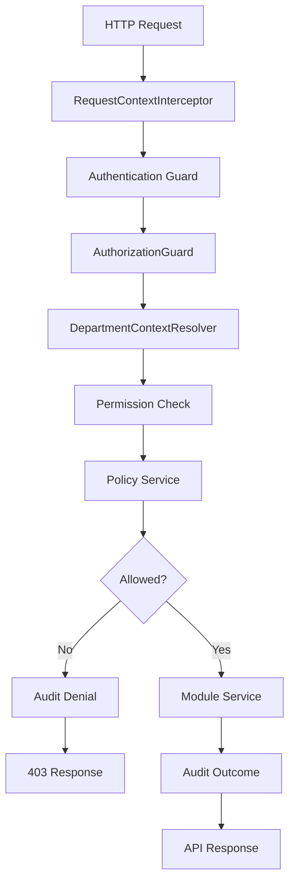
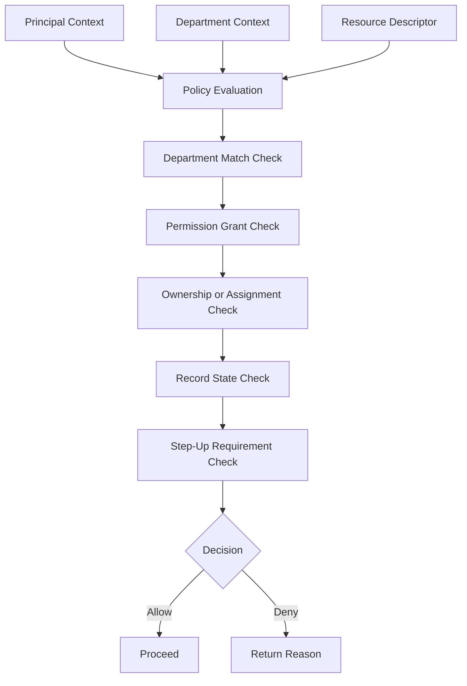
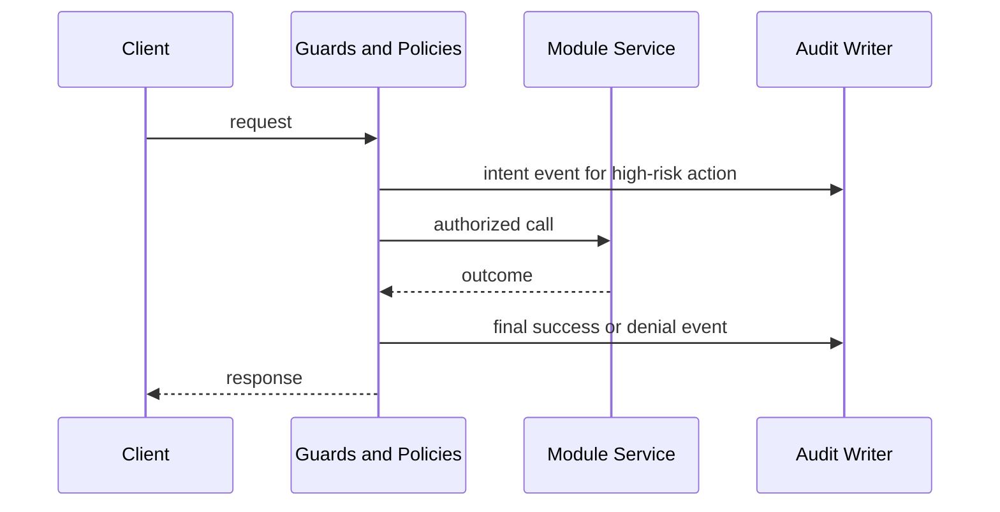

# Identity & Access Design

## Strategy

Lexora LMS uses department-scoped RBAC plus scoped policy evaluation. Roles grant baseline permission sets, but permissions alone never authorize access to a specific record. Every sensitive decision evaluates all of the following:

- authenticated principal
- active department context
- requested permission
- target resource type
- resource ownership or assignment
- record state restrictions
- step-up authentication requirement
- audit requirement

The model is deny-by-default. There is no super-admin role and no cross-department bypass role. Department administrators are powerful within their own department but do not inherit unrestricted access to every sensitive identity action. Public verification is isolated from authenticated department work and uses a separate `public_verification` permission scope.

## RBAC Model

### `department_admin`

- Administrative authority inside one department only
- Manages users, role assignments, department settings, operational reporting, file governance, and security overrides
- Cannot bypass department scoping
- Step-up authentication required for high-impact actions such as role changes, override approval, forced logout, bulk session revocation, sensitive department settings, and audit export
- Mandatory 2FA

### `teacher`

- Instruction-facing role with access to teaching resources assigned inside the active department
- Access depends on ownership or assignment checks for courses, sessions, assessments, and discussions
- Cannot manage department-wide identity settings or cross-user administrative actions
- Mandatory 2FA

### `student`

- Learner-facing role limited to self records and explicitly assigned course context
- Mostly `self` or enrollment-based access, never department-wide administration
- Optional multi-device login with risk controls
- 2FA optional by default, but step-up may be required for transcript access, sensitive file retrieval, or account recovery confirmation

### `auditor`

- Read-focused compliance role within a department
- Can inspect audit, reporting, selected academic evidence, and verification-related artifacts
- Cannot mutate academic records except explicitly modeled audit/compliance acknowledgements if introduced later
- Step-up required for audit export and override review
- Mandatory 2FA

### `support`

- Operational support role inside a department with narrow assistance privileges
- Can assist with account unlock, session revocation, password reset initiation, and troubleshooting reads
- Cannot change role assignments, department security baselines, or academic records beyond tightly defined support actions
- Step-up required for forced logout, account recovery assistance, and sensitive identity actions
- Mandatory 2FA

## Permission Catalog

Each permission is encoded as `domain.resource.action`, mapped to a scope of `department`, `self`, or `public_verification`.

### identity-access

- `identity-access.session.read_department`
- `identity-access.session.read_self`
- `identity-access.session.revoke_department`
- `identity-access.session.revoke_self`
- `identity-access.session.force_logout`
- `identity-access.auth.step_up`
- `identity-access.auth.manage_2fa_department`
- `identity-access.auth.manage_2fa_self`
- `identity-access.auth.password_reset_initiate_department`
- `identity-access.auth.password_reset_initiate_self`
- `identity-access.auth.password_reset_complete_self`
- `identity-access.auth.email_verification_issue_department`
- `identity-access.auth.email_verification_resend_self`
- `identity-access.auth.account_unlock_department`
- `identity-access.auth.login_risk_review_department`

### user-management

- `user-management.user.read_department`
- `user-management.user.read_self`
- `user-management.user.create_department`
- `user-management.user.update_department`
- `user-management.user.update_self`
- `user-management.user.archive_department`
- `user-management.user.assign_role_department`
- `user-management.user.revoke_role_department`
- `user-management.user.read_roles_self`

### department-config

- `department-config.department.read_department`
- `department-config.department.update_department`
- `department-config.settings.read_department`
- `department-config.settings.update_department`
- `department-config.rules.read_department`
- `department-config.rules.update_department`

### course-management

- `course-management.course.read_department`
- `course-management.course.read_assigned`
- `course-management.course.read_enrolled`
- `course-management.course.create_department`
- `course-management.course.update_assigned`
- `course-management.course.archive_department`

### enrollment

- `enrollment.enrollment.read_department`
- `enrollment.enrollment.read_self`
- `enrollment.enrollment.create_department`
- `enrollment.enrollment.update_department`
- `enrollment.enrollment.archive_department`

### attendance

- `attendance.record.read_department`
- `attendance.record.read_assigned`
- `attendance.record.read_self`
- `attendance.record.create_assigned`
- `attendance.record.update_assigned`
- `attendance.record.archive_department`

### assignment

- `assignment.assignment.read_department`
- `assignment.assignment.read_assigned`
- `assignment.assignment.read_self`
- `assignment.assignment.create_assigned`
- `assignment.assignment.update_assigned`
- `assignment.assignment.archive_assigned`
- `assignment.submission.read_department`
- `assignment.submission.read_assigned`
- `assignment.submission.read_self`
- `assignment.submission.create_self`
- `assignment.submission.update_self_draft`
- `assignment.submission.grade_assigned`

### quiz

- `quiz.quiz.read_department`
- `quiz.quiz.read_assigned`
- `quiz.quiz.read_self`
- `quiz.quiz.create_assigned`
- `quiz.quiz.update_assigned`
- `quiz.quiz.archive_assigned`
- `quiz.attempt.read_assigned`
- `quiz.attempt.read_self`
- `quiz.attempt.create_self`
- `quiz.attempt.submit_self`
- `quiz.attempt.grade_assigned`

### result-processing

- `result-processing.result.read_department`
- `result-processing.result.read_self`
- `result-processing.result.generate_department`
- `result-processing.result.update_department`
- `result-processing.result.publish_department`
- `result-processing.result.override_department`

### transcript-verification

- `transcript-verification.transcript.read_department`
- `transcript-verification.transcript.read_self`
- `transcript-verification.transcript.issue_department`
- `transcript-verification.transcript.revoke_department`
- `transcript-verification.verification.read_public`
- `transcript-verification.verification.issue_department`

### discussion

- `discussion.thread.read_department`
- `discussion.thread.read_assigned`
- `discussion.thread.read_self`
- `discussion.thread.create_assigned`
- `discussion.thread.update_owner`
- `discussion.thread.moderate_department`
- `discussion.post.create_assigned`
- `discussion.post.update_owner`
- `discussion.post.moderate_department`

### notification

- `notification.notification.read_department`
- `notification.notification.read_self`
- `notification.notification.create_department`
- `notification.notification.create_assigned`
- `notification.notification.update_department`
- `notification.notification.dismiss_self`

### file-storage

- `file-storage.file.read_department`
- `file-storage.file.read_owner`
- `file-storage.file.read_public_verification`
- `file-storage.file.create_department`
- `file-storage.file.create_self`
- `file-storage.file.update_owner`
- `file-storage.file.quarantine_department`
- `file-storage.file.delete_department`

### audit-compliance

- `audit-compliance.audit.read_department`
- `audit-compliance.audit.export_department`
- `audit-compliance.override.read_department`
- `audit-compliance.override.request_department`
- `audit-compliance.override.approve_department`
- `audit-compliance.override.execute_department`

### reporting-dashboard

- `reporting-dashboard.dashboard.read_department`
- `reporting-dashboard.dashboard.export_department`

### system-configuration

- `system-configuration.security.read_department`
- `system-configuration.security.update_department`
- `system-configuration.integration.read_department`
- `system-configuration.integration.update_department`

## Role-Permission Matrix

Legend:

- `D`: department-wide base permission
- `O`: ownership, assignment, or enrollment check also required
- `A`: audit mandatory
- `S`: step-up authentication required

| Permission | department_admin | teacher | student | auditor | support | Notes |
| --- | --- | --- | --- | --- | --- | --- |
| `identity-access.session.read_department` | D |  |  | D | D | A for privileged reads |
| `identity-access.session.read_self` |  |  | O |  |  | Self only |
| `identity-access.session.revoke_department` | D/A/S |  |  |  | D/A/S | Cannot cross departments |
| `identity-access.session.revoke_self` |  |  | O/A |  |  | Self session revocation |
| `identity-access.session.force_logout` | D/A/S |  |  |  | D/A/S | High-impact |
| `identity-access.auth.step_up` | D/O/A | O/A | O/A | O/A | O/A | Internal auth operation |
| `identity-access.auth.manage_2fa_department` | D/A/S |  |  |  | D/A/S | Support limited to recovery assistance |
| `identity-access.auth.manage_2fa_self` |  | O/A | O/A |  |  | Self only |
| `identity-access.auth.password_reset_initiate_department` | D/A/S |  |  |  | D/A/S | For admin/support assistance |
| `identity-access.auth.password_reset_initiate_self` |  |  | O/A |  |  | Self recovery start |
| `identity-access.auth.password_reset_complete_self` |  |  | O/A/S |  |  | Step-up if risk detected |
| `identity-access.auth.email_verification_issue_department` | D/A |  |  |  | D/A | Limited operational use |
| `identity-access.auth.email_verification_resend_self` |  |  | O |  |  | Self only |
| `identity-access.auth.account_unlock_department` | D/A/S |  |  |  | D/A/S | Lockout recovery |
| `identity-access.auth.login_risk_review_department` | D/A/S |  |  | D/A/S | D/A/S | Security review |
| `user-management.user.read_department` | D |  |  | D | D | Filter sensitive fields by role |
| `user-management.user.read_self` |  |  | O |  |  | Self profile |
| `user-management.user.create_department` | D/A/S |  |  |  |  | User provisioning |
| `user-management.user.update_department` | D/A |  |  |  | D/A | Support limited by field policy |
| `user-management.user.update_self` |  | O | O |  |  | Self-maintained profile subset |
| `user-management.user.archive_department` | D/A/S |  |  |  |  | High-impact lifecycle action |
| `user-management.user.assign_role_department` | D/A/S |  |  |  |  | Restricted to allowed roles |
| `user-management.user.revoke_role_department` | D/A/S |  |  |  |  | Restricted to allowed roles |
| `user-management.user.read_roles_self` |  | O | O |  |  | Visibility only |
| `department-config.department.read_department` | D |  |  | D | D | Department metadata |
| `department-config.department.update_department` | D/A/S |  |  |  |  | High-impact |
| `department-config.settings.read_department` | D |  |  | D | D | Some secrets redacted |
| `department-config.settings.update_department` | D/A/S |  |  |  |  | Config-driven rules |
| `department-config.rules.read_department` | D |  |  | D | D | Academic/security rules |
| `department-config.rules.update_department` | D/A/S |  |  |  |  | High-impact |
| `course-management.course.read_department` | D |  |  | D |  | Full department read |
| `course-management.course.read_assigned` |  | O |  |  |  | Assigned teaching context |
| `course-management.course.read_enrolled` |  |  | O |  |  | Enrolled context |
| `course-management.course.create_department` | D/A |  |  |  |  | Future module action |
| `course-management.course.update_assigned` |  | O/A |  |  |  | Assignment required |
| `course-management.course.archive_department` | D/A/S |  |  |  |  | High-impact |
| `enrollment.enrollment.read_department` | D |  |  | D |  | Department reports/compliance |
| `enrollment.enrollment.read_self` |  |  | O |  |  | Student self |
| `enrollment.enrollment.create_department` | D/A |  |  |  |  | Future module action |
| `enrollment.enrollment.update_department` | D/A |  |  |  |  | Future module action |
| `enrollment.enrollment.archive_department` | D/A/S |  |  |  |  | High-impact |
| `attendance.record.read_department` | D |  |  | D |  | Compliance reporting |
| `attendance.record.read_assigned` |  | O |  |  |  | Teacher assigned classes |
| `attendance.record.read_self` |  |  | O |  |  | Student self |
| `attendance.record.create_assigned` |  | O/A |  |  |  | Teacher assignment required |
| `attendance.record.update_assigned` |  | O/A |  |  |  | Before lock/finalization |
| `attendance.record.archive_department` | D/A/S |  |  |  |  | High-impact |
| `assignment.assignment.read_department` | D |  |  | D |  | Broad review |
| `assignment.assignment.read_assigned` |  | O |  |  |  | Teacher assignment |
| `assignment.assignment.read_self` |  |  | O |  |  | Student enrollment |
| `assignment.assignment.create_assigned` |  | O/A |  |  |  | Teacher assignment |
| `assignment.assignment.update_assigned` |  | O/A |  |  |  | Pre-publish or editable state |
| `assignment.assignment.archive_assigned` |  | O/A/S |  |  |  | Sensitive archive |
| `assignment.submission.read_department` | D |  |  | D |  | Compliance read |
| `assignment.submission.read_assigned` |  | O |  |  |  | Teacher grading context |
| `assignment.submission.read_self` |  |  | O |  |  | Submitter only |
| `assignment.submission.create_self` |  |  | O/A |  |  | Enrolled and open window |
| `assignment.submission.update_self_draft` |  |  | O/A |  |  | Draft/open only |
| `assignment.submission.grade_assigned` |  | O/A/S |  |  |  | Sensitive academic action |
| `quiz.quiz.read_department` | D |  |  | D |  | Department read |
| `quiz.quiz.read_assigned` |  | O |  |  |  | Teacher assignment |
| `quiz.quiz.read_self` |  |  | O |  |  | Student eligible view |
| `quiz.quiz.create_assigned` |  | O/A |  |  |  | Teacher assignment |
| `quiz.quiz.update_assigned` |  | O/A |  |  |  | Editable state only |
| `quiz.quiz.archive_assigned` |  | O/A/S |  |  |  | Sensitive |
| `quiz.attempt.read_assigned` |  | O |  |  |  | Teacher grading review |
| `quiz.attempt.read_self` |  |  | O |  |  | Student self |
| `quiz.attempt.create_self` |  |  | O/A |  |  | Enrolled and available |
| `quiz.attempt.submit_self` |  |  | O/A |  |  | Open attempt only |
| `quiz.attempt.grade_assigned` |  | O/A/S |  |  |  | Sensitive |
| `result-processing.result.read_department` | D |  |  | D |  | Restricted by sensitivity |
| `result-processing.result.read_self` |  |  | O |  |  | Student self |
| `result-processing.result.generate_department` | D/A/S |  |  |  |  | Sensitive bulk operation |
| `result-processing.result.update_department` | D/A/S |  |  |  |  | Sensitive academic record |
| `result-processing.result.publish_department` | D/A/S |  |  |  |  | High-impact |
| `result-processing.result.override_department` | D/A/S |  |  |  |  | Override workflow |
| `transcript-verification.transcript.read_department` | D |  |  | D |  | Sensitive read |
| `transcript-verification.transcript.read_self` |  |  | O/S |  |  | Step-up recommended |
| `transcript-verification.transcript.issue_department` | D/A/S |  |  |  |  | High-impact |
| `transcript-verification.transcript.revoke_department` | D/A/S |  |  |  |  | High-impact |
| `transcript-verification.verification.read_public` |  |  |  |  |  | Public scope only |
| `transcript-verification.verification.issue_department` | D/A/S |  |  |  |  | Public artifact issuance |
| `discussion.thread.read_department` | D |  |  | D |  | Moderation/compliance |
| `discussion.thread.read_assigned` |  | O |  |  |  | Teacher teaching context |
| `discussion.thread.read_self` |  |  | O |  |  | Student enrolled context |
| `discussion.thread.create_assigned` |  | O/A | O/A |  |  | Role-specific context |
| `discussion.thread.update_owner` |  | O/A | O/A |  |  | Owner plus state checks |
| `discussion.thread.moderate_department` | D/A |  |  |  | D/A | Moderation |
| `discussion.post.create_assigned` |  | O/A | O/A |  |  | Thread access required |
| `discussion.post.update_owner` |  | O/A | O/A |  |  | Owner and open state |
| `discussion.post.moderate_department` | D/A |  |  |  | D/A | Moderation |
| `notification.notification.read_department` | D |  |  | D | D | Operational visibility |
| `notification.notification.read_self` |  | O | O |  |  | Own inbox |
| `notification.notification.create_department` | D/A |  |  |  | D/A | Broadcast/admin |
| `notification.notification.create_assigned` |  | O/A |  |  |  | Teacher assigned courses |
| `notification.notification.update_department` | D/A |  |  |  | D/A | Draft/cancel |
| `notification.notification.dismiss_self` |  | O | O |  |  | Self only |
| `file-storage.file.read_department` | D |  |  | D | D | Filter by sensitivity |
| `file-storage.file.read_owner` |  | O | O |  |  | Owner/attached record access |
| `file-storage.file.read_public_verification` |  |  |  |  |  | Public scope only |
| `file-storage.file.create_department` | D/A | O/A |  |  | D/A | Depending on module use |
| `file-storage.file.create_self` |  |  | O/A |  |  | Self submission/profile evidence |
| `file-storage.file.update_owner` |  | O/A | O/A |  |  | Mutable metadata only |
| `file-storage.file.quarantine_department` | D/A/S |  |  | D/A/S | D/A/S | Security action |
| `file-storage.file.delete_department` | D/A/S |  |  |  |  | High-impact |
| `audit-compliance.audit.read_department` | D |  |  | D |  | Sensitive read |
| `audit-compliance.audit.export_department` | D/A/S |  |  | D/A/S |  | Step-up mandatory |
| `audit-compliance.override.read_department` | D |  |  | D | D | Sensitive read |
| `audit-compliance.override.request_department` | D/A/S |  |  |  | D/A/S | Support/admin only |
| `audit-compliance.override.approve_department` | D/A/S |  |  | D/A/S |  | Segregation of duties preferred |
| `audit-compliance.override.execute_department` | D/A/S |  |  |  |  | Post-approval only |
| `reporting-dashboard.dashboard.read_department` | D |  |  | D | D | Aggregated read |
| `reporting-dashboard.dashboard.export_department` | D/A/S |  |  | D/A/S |  | Export sensitive |
| `system-configuration.security.read_department` | D |  |  | D | D | Secrets masked |
| `system-configuration.security.update_department` | D/A/S |  |  |  |  | High-impact |
| `system-configuration.integration.read_department` | D |  |  | D | D | Mask secrets |
| `system-configuration.integration.update_department` | D/A/S |  |  |  |  | High-impact |

## Policy Rule Catalog

### users

- Read:
  - `department_admin`, `support`, `auditor` can read department users
  - `teacher` and `student` can read self only
- Create:
  - `department_admin` only
- Update:
  - `department_admin` can update department users except immutable security anchors without step-up
  - `support` can update limited operational fields
  - users can update self profile subset
- Archive/Delete:
  - `department_admin` only, archive preferred over delete
- Ownership:
  - self-service changes limited to own profile
- Department scope:
  - user and actor department must match
- Record state:
  - archived users cannot be modified except restoration workflow
- Audit:
  - mandatory for create, archive, role changes, security-sensitive field changes
- Step-up:
  - required for archive, role assignment, email change by admin/support, forced unlock

### departments

- Read:
  - `department_admin`, `support`, `auditor`
- Create:
  - not exposed in department-scoped administration baseline
- Update:
  - `department_admin`
- Archive/Delete:
  - not routine; archive via controlled platform process if ever introduced
- Ownership:
  - none
- Department scope:
  - only active department record
- Record state:
  - disabled/archived departments become read-only
- Audit:
  - mandatory
- Step-up:
  - required

### courses

- Read:
  - admin/auditor department-wide
  - teacher if assigned
  - student if enrolled
- Create:
  - department admin
- Update:
  - admin department-wide
  - teacher only if assigned and editable fields are teacher-managed
- Archive/Delete:
  - admin only
- Ownership:
  - teacher assignment required for teacher mutation
- Department scope:
  - target course department must equal active department
- Record state:
  - archived courses are read-only
- Audit:
  - create, archive, ownership changes
- Step-up:
  - archive and reassignment

### enrollments

- Read:
  - admin/auditor department-wide
  - student self
- Create/Update:
  - department admin
- Archive/Delete:
  - department admin
- Ownership:
  - self read only for enrolled student
- Department scope:
  - enrollment, user, and course must share department
- Record state:
  - finalized/archived enrollment blocks destructive change
- Audit:
  - mandatory for create, status change, archive
- Step-up:
  - not for routine create; yes for override/forced status change

### sessions

- Read:
  - admin/support/auditor department-wide
  - user self sessions
- Create:
  - internal auth flow only
- Update:
  - internal auth flow only
- Archive/Delete:
  - revoke rather than delete
- Ownership:
  - self revoke allowed for own sessions
- Department scope:
  - session department must match active department
- Record state:
  - revoked/expired sessions are immutable except audit annotations
- Audit:
  - mandatory for creation, revocation, forced logout, suspicious flags
- Step-up:
  - required for forced logout and broad revocation

### attendance records

- Read:
  - admin/auditor department-wide
  - teacher assigned
  - student self
- Create/Update:
  - teacher assigned
  - admin by override only
- Archive/Delete:
  - admin only through override path
- Ownership:
  - teacher must be assigned to class/session
- Department scope:
  - class session and student must share department
- Record state:
  - locked/finalized attendance cannot be changed without override
- Audit:
  - mandatory
- Step-up:
  - required for override or post-finalization change

### assignments

- Read:
  - admin/auditor department-wide
  - teacher assigned
  - student enrolled
- Create/Update:
  - teacher assigned
  - admin by department oversight
- Archive/Delete:
  - teacher assigned or admin, depending on final policy
- Ownership:
  - teacher assignment required
- Department scope:
  - assignment department must equal active department
- Record state:
  - published/closed assignments have restricted mutation
- Audit:
  - mandatory for archive and deadline/security-sensitive changes
- Step-up:
  - required for archive or retroactive deadline changes

### submissions

- Read:
  - teacher grading context
  - admin/auditor department-wide
  - student own submission
- Create:
  - student self
- Update:
  - student while draft/open
  - teacher grade/feedback if assigned
- Archive/Delete:
  - archive only through controlled workflow
- Ownership:
  - submitter owns draft updates
  - teacher ownership comes from assignment ownership
- Department scope:
  - submission, assignment, and student must share department
- Record state:
  - submitted/graded/finalized states restrict mutation
- Audit:
  - mandatory for grade changes
- Step-up:
  - required for final grade override

### quizzes

- Read:
  - admin/auditor department-wide
  - teacher assigned
  - student eligible participant
- Create/Update:
  - teacher assigned
- Archive/Delete:
  - teacher assigned or admin by policy
- Ownership:
  - teacher assignment required
- Department scope:
  - department match required
- Record state:
  - active quiz cannot be materially altered without override
- Audit:
  - mandatory for publish/archive/security-sensitive timing changes
- Step-up:
  - required for post-publication high-impact changes

### results

- Read:
  - admin/auditor department-wide
  - student self
- Create/Update:
  - result-processing service or department admin workflow
- Archive/Delete:
  - not routine; use supersede/override patterns
- Ownership:
  - self read only for student result
- Department scope:
  - department match required
- Record state:
  - published/finalized results require override path to change
- Audit:
  - mandatory
- Step-up:
  - required for generation, publish, override

### transcripts

- Read:
  - admin/auditor department-wide
  - student self
  - public verification only through isolated verification artifact
- Create:
  - department admin issuance workflow
- Update:
  - not direct; supersede/reissue preferred
- Archive/Delete:
  - revoke/reissue instead of delete
- Ownership:
  - student self access only to own transcript
- Department scope:
  - transcript and student department must match
- Record state:
  - issued transcripts immutable except revocation metadata
- Audit:
  - mandatory
- Step-up:
  - required for issue, revoke, export, self transcript retrieval if sensitive

### file objects

- Read:
  - admin/support/auditor department-wide as allowed by attachment context
  - owner or attached-resource participants
  - public verification only if explicitly marked
- Create:
  - admin/support/teacher/student depending on attachment flow
- Update:
  - owner metadata only while not archived/quarantined
- Archive/Delete:
  - admin only
  - quarantine by admin/auditor/support security path
- Ownership:
  - uploader alone is not enough if resource-based access is stricter
- Department scope:
  - file department must equal active department unless public verification object
- Record state:
  - quarantined/deleted objects unavailable except compliance review
- Audit:
  - mandatory for delete, quarantine, sensitive reads
- Step-up:
  - required for delete/quarantine and high-sensitivity retrieval

### discussions

- Read:
  - admin/auditor department-wide
  - teacher assigned
  - student enrolled/participant
- Create:
  - teacher/student within authorized course context
- Update:
  - owner while editable
  - moderators through moderation privilege
- Archive/Delete:
  - moderation/admin only or owner before replies if policy allows
- Ownership:
  - owner-based update rule
- Department scope:
  - thread/post must remain in active department
- Record state:
  - locked/moderated/archived threads restrict mutation
- Audit:
  - mandatory for moderation actions
- Step-up:
  - only for exceptional moderation overrides

### audit logs

- Read:
  - auditor and department admin
  - support only when explicitly granted narrow troubleshooting scope
- Create:
  - system only
- Update:
  - append-only annotations only if ever allowed
- Archive/Delete:
  - never through routine application flow
- Ownership:
  - not applicable
- Department scope:
  - only logs for active department, except public verification logs tagged as exception context
- Record state:
  - immutable
- Audit:
  - access itself should be audited
- Step-up:
  - required for export

### override actions

- Read:
  - admin, auditor, support as scoped
- Create:
  - admin/support can request
- Update:
  - approve/execute by allowed actors only
- Archive/Delete:
  - revoke, not delete
- Ownership:
  - requester cannot be sole approver for highest-risk categories where segregation is enabled
- Department scope:
  - request and target must stay in same department
- Record state:
  - executed/revoked/rejected are terminal
- Audit:
  - mandatory at every stage
- Step-up:
  - required for request, approval, and execution

## Authorization Architecture

### Route Guard Flow

1. `RequestContextInterceptor` creates request context and request id.
2. Authentication guard resolves principal and attaches `PrincipalContext`.
3. `AuthorizationGuard` reads metadata from decorators.
4. `DepartmentContextResolver` resolves active department or public verification context.
5. Permission gate checks required permission(s).
6. Policy service evaluates ownership, resource state, department match, and step-up requirements.
7. Request proceeds to module service only if all checks succeed.
8. Audit writer records sensitive allow/deny outcomes.

### Permission Decorator Pattern

- `@RequirePermissions(...)` declares baseline permission grants.
- `@RequirePolicies(...)` declares resource-specific policy names.
- `@RequireStepUp(...)` declares step-up policy for the action.
- `@AuditAction(...)` declares audit metadata for controller/service handlers.

### Policy Evaluation Flow

1. Resolve principal context
2. Resolve department context
3. Resolve target resource descriptor
4. Ensure department scope match
5. Ensure permission present for role scope
6. Ensure ownership/assignment checks pass
7. Ensure record-state restrictions pass
8. Ensure step-up satisfied if required
9. Return allow or deny with policy reason

### Ownership Check Flow

- Ownership is resource-specific, not role-specific
- Examples:
  - user self access: `resource.userId === principal.actorId`
  - teacher assignment: `resource.teacherIds` contains principal
  - student enrolled access: `resource.studentId === principal.actorId` or enrollment exists
  - discussion owner edit: `resource.authorUserId === principal.actorId`
- Ownership checks never replace department checks

### Department Scope Check Flow

- Department context comes from active principal department for authenticated requests
- Public verification is explicit exception context
- Policy layer compares:
  - `requestContext.department.departmentId`
  - resource department
  - principal active department
- Any mismatch denies access unless the route is explicitly public verification

### Audit Before/After Pattern

- Before:
  - record intent for highest-risk actions such as override approval, role changes, export, revoke, forced logout
- After:
  - record outcome, target id, and any state changes
- Denials:
  - record denied attempts for sensitive operations

### Request Context, Policy Service, and Module Service Interaction

- Controllers stay thin and declare metadata
- Guards and interceptors populate context
- Module service loads resource descriptor through its own module boundary
- Policy service evaluates access using descriptor data, not raw controller params alone
- Module service executes the change
- Audit writer persists final event

## Security Rules

### Brute-force Protection

- Rate limit by IP, normalized email, and device fingerprint
- Progressive backoff after repeated failures
- Distinct auth limiter stricter than general API limiter

### Failed Login Lockout

- Lock account temporarily after threshold failures
- Department admins and support can unlock with audit and step-up
- Lockout windows increase on repeated abuse

### Concurrent Session Rules

- Teachers, admins, auditors, and support have stricter concurrent session caps
- Students may keep multiple active sessions within configurable limits
- High-risk session creation can revoke older sessions automatically

### Suspicious IP/Device Login Detection

- Flag first-seen device, unusual geo/IP shifts, impossible travel heuristics, rapid device churn, and repeated failed step-up attempts
- Require step-up or block depending on policy

### Session Revocation

- Self revocation for own sessions
- Department admin/support can revoke department user sessions with step-up and audit
- Security-triggered revocation on password reset, role downgrade, 2FA reset, or suspicious activity

### Forced Logout

- Allowed only for department admin/support with step-up
- Always audited

### Password Reset Token Rules

- Single-use, hashed at rest, short TTL
- Invalidated on password change
- Completion may require step-up when risk signals exist

### Email Verification Token Rules

- Single-use, hashed at rest, short TTL
- Resend throttled
- Prior tokens invalidated on reissue

### Teacher/Admin Mandatory 2FA

- `department_admin`, `teacher`, `auditor`, and `support` must enroll 2FA before privileged access
- Fallback recovery requires audited support/admin flow with step-up

### Student Optional Multi-Device Login

- Allowed within configurable session cap
- Risk engine may require step-up for transcript access, suspicious login, recovery completion, or new device

## Prisma Additions Needed

Minimal schema additions are justified for identity risk, device/session hygiene, and declarative step-up policy metadata:

- `LoginAttempt`
  - brute-force controls
  - lockout analytics
  - suspicious login correlation
- `SuspiciousLoginEvent`
  - risk scoring evidence
  - incident review
- `StepUpRequirement`
  - declarative metadata for high-risk actions
- Session enhancements
  - device fingerprint hash
  - trust flag
  - revocation reason
  - last IP / last user-agent

## Recommendations and Tradeoffs

- Prefer permission breadth plus policy depth. Fine-grained permissions for every field will become brittle; keep permissions coarse and let policy service handle ownership and state.
- Keep department-admin strong but not absolute. It reduces operational friction without breaking tenant isolation.
- Use append-oriented audit plus override workflow instead of destructive mutation for sensitive academic records.
- Require 2FA for every privileged non-student role from day one. Retro-fitting it later is painful.
- Keep public verification as a separate scope, not a special case of authenticated permissions.
- Add risk-based step-up now as metadata even if challenge flows are implemented later. It keeps controller and policy APIs stable.
